# Tech Judge website blueprint

Status: Design and copy specification. No production code.

This document translates the discovery interview into a complete website direction. Client names and proof are approved for private drafts. Obtain client approval before public publication.

## 1. The decision behind the redesign

Tech Judge should not look like a typical MSP, a home automation showroom, or a low-voltage contractor. It is broader than all three.

The central idea is simple:

> Tech Judge can plan the environment, build the infrastructure, support the people using it, and remain responsible after installation.

The website should give Managed IT, Infrastructure and Security, and Luxury Smart Homes equal visual prominence. Managed IT should receive the deepest conversion path because it produces consistent recurring revenue. The other two divisions should demonstrate the physical workmanship and breadth that make Tech Judge different from a standard MSP.

### Business priorities

- Protect and grow recurring managed IT revenue.
- Turn office and property projects into ongoing support relationships.
- Increase qualified luxury residential enquiries.
- Make phone calls, messages, and site-walk requests equally easy.
- Show enough technical depth to establish authority without overwhelming the visitor.

### Primary audiences

- Business owners who need Tech Judge to become their IT department.
- Property managers who need networks, cameras, access control, and consistent support across one or more properties.
- Homeowners who want dependable networking, cameras, access, lighting, audio, and automation.

### What clients are usually experiencing

- A major system is down.
- IT problems have become a daily distraction.
- A new office or property needs infrastructure quickly.
- Their current provider does the minimum and rarely follows through.
- They need a realistic scope, budget, and completion timeline.
- They found Tech Judge through a referral or the UniFi installer directory.

### Positioning

Established technology authority. Dependable local partner.

The authority comes from technical breadth, more than 20 years of combined leadership experience, C7 licensing, platform expertise, and support across more than 50 locations. The local-partner quality comes from direct conversations, detailed site walks, honest recommendations, clean work, testing, and continued ownership.

## 2. Voice and copy rules

The voice should be knowledgeable, premium, approachable, technical, and relatable. It should sound like an experienced person explaining the job clearly.

### Writing principles

- Use short, direct sentences.
- Name the actual work: networks, racks, cabling, email security, cameras, access control, VoIP, servers, and user support.
- Explain technical ideas without speaking down to the reader.
- Make claims specific and supportable.
- Use contractions when they sound natural.
- Let project details carry the authority.
- Use headings that could plausibly be said in a client conversation.

### Avoid

- Seamless
- Revolutionize
- Unlock
- Cutting-edge
- Future-proof
- Elevate
- Transform your business
- Comprehensive solutions
- World-class
- Empty uses of expert, innovative, tailored, or state-of-the-art
- Em dashes and en dashes
- Eyebrow labels above every heading
- Visible section numbering
- Repetitive top-right arrows
- A symmetrical row of three feature cards as the default section pattern

## 3. Visual direction

### Overall character

The visual system should feel precise, calm, and expensive without becoming theatrical. It should borrow the atmosphere of the reference sites, not their SaaS-template patterns.

Use:

- Oversized, left-aligned sans-serif headlines.
- Large areas of breathing room.
- A subtle technical grid that fades in and out rather than covering every section.
- Controlled lighting effects that respond to scroll position.
- Full-width editorial layouts and offset image compositions.
- Real project details, diagrams, and equipment photography.
- Thin rules and alignment changes instead of excessive cards.
- A dark default theme with a complete light theme.

### Color recommendation

Gold should be the recognizable brand accent because it separates Tech Judge from the sea of blue MSP websites and also supports the premium residential division. Blue should remain a secondary technical signal, used in managed IT diagrams, system status details, and ambient lighting.

#### Dark theme

- Canvas: near-black ink, `#090B0F`
- Raised surface: `#12161C`
- Primary text: warm white, `#F4F2EC`
- Secondary text: `#A7ABB2`
- Brand gold: `#C8A45E`
- Gold highlight: `#D9BB78`
- Technical blue: `#4B72FF`
- Structural line: white at 10 percent opacity

#### Light theme

- Canvas: warm bone, `#F4F1E9`
- Raised surface: `#FFFFFF`
- Primary text: `#11151A`
- Secondary text: `#5E646D`
- Accessible bronze: `#8A6728`
- Technical blue: `#3158D4`
- Structural line: ink at 12 percent opacity

The logo should appear in white and gold in dark mode, and ink and bronze in light mode. Green should be removed from the site system.

### Typography

Use one clean sans-serif family throughout. Instrument Sans is the recommended starting point because it feels modern without looking like a default startup template. Use regular, medium, and semibold weights only.

- Display headlines: Instrument Sans Semibold
- Body copy: Instrument Sans Regular
- Interface labels: Instrument Sans Medium
- Technical data: the same family with tabular numbers

Do not introduce a decorative serif. Hierarchy should come from scale, spacing, and composition.

### Theme behavior

- First visit opens in dark mode.
- A labeled appearance control allows the visitor to switch to light mode.
- The visitor's choice persists on later visits.
- Both themes are complete designs. Light mode must not feel like a color inversion.
- The toggle should use clear sun and moon symbols with an accessible label.

## 4. Information architecture

The primary navigation should stay focused on what visitors need.

### Main navigation

- Services
  - Managed IT and Cybersecurity
  - Infrastructure and Security
  - Luxury Smart Homes
- Projects
- Pricing
- About
- Contact

The header should also show the phone number and the appearance toggle. Existing-client support belongs in a small utility link and the footer, not in the primary sales path.

### Supporting pages

Audience pages remain useful for search, referrals, and contextual links, but they should not dominate the main navigation.

- Small and Medium Businesses
- Property Management
- General Contractors
- Architects and Designers
- Luxury Home Builders
- What Is an MSP?
- Partners and Platforms
- Careers
- Southern California Service Area
- Existing Client Support

### Recommended sitemap

```mermaid
flowchart TD
    H[Home] --> S[Services]
    S --> M[Managed IT and Cybersecurity]
    S --> I[Infrastructure and Security]
    S --> L[Luxury Smart Homes]
    H --> P[Projects]
    P --> PC[Pinnacle multi-office case study]
    P --> PF[Future project and testimonial stories]
    H --> PR[Managed IT pricing]
    H --> A[About]
    A --> TP[Partners and platforms]
    A --> C[Careers]
    H --> CT[Contact]
    CT --> SW[Request a site walk]
    CT --> SP[Existing client support]
    H --> W[Who we help]
    W --> B[Small and medium businesses]
    W --> PM[Property management]
    W --> GC[General contractors]
    W --> AD[Architects and designers]
    W --> LB[Luxury home builders]
    H --> R[Resources]
    R --> MSP[What is an MSP?]
    R --> SA[Southern California service area]
```

## 5. Global experience

### Header

Desktop layout:

- Left: Tech Judge logo.
- Center: Services, Projects, Pricing, About.
- Right: phone number, Contact button, appearance toggle.
- Services opens a restrained text menu with the three divisions and one-sentence descriptions.
- The header begins transparent over the hero and gains a solid surface after the first scroll threshold.

Mobile layout:

- Logo, call button, appearance toggle, menu.
- The open menu shows the three services first.
- Phone and Contact remain visible without scrolling through the entire menu.

### Buttons and links

- Primary action: solid gold in dark mode, bronze in light mode.
- Secondary action: transparent with a quiet border.
- Text link: underlined on hover or focus.
- No arrow glyphs are needed.
- Button language should describe the result: Tell us what you need, Request a site walk, Estimate monthly IT, Call Tech Judge.

### Footer

Use a large, calm footer rather than many small columns.

Left block:

> Tech Judge Inc.  
> Technology support, infrastructure, security, and smart-home integration across Southern California.

Contact block:

> (818) 213-2050  
> info@techjudge.com  
> 21943 Plummer St.  
> Chatsworth, CA 91311

Links should include Services, Projects, Pricing, About, Partners, Careers, Contact, Existing Client Support, Privacy, and Terms.

Trust line:

> California C7 License #1142144  
> Leadership with more than 20 years of combined experience

## 6. Homepage

### Purpose

Explain the breadth of the company without making it feel unfocused. Help visitors identify the work they need, trust the team, and call, send a message, or request a site walk.

### Wireframe

1. Full-screen hero with a shifting technical environment.
2. Quiet credibility line with verified facts.
3. Three full-width service chapters controlled by scroll.
4. Pinnacle client story.
5. Consultative working style.
6. Reviews and referral proof.
7. Managed IT planning calculator invitation.
8. Southern California service area.
9. Three-way contact section.

The three services must not appear as equal cards. Each receives its own full-width chapter with a distinct image composition and motion state.

### Hero copy

# Technology should be the part you don't have to chase.

Tech Judge plans, installs, and supports the IT, networks, security, and smart-home systems people rely on every day. One local team stays responsible from the first site walk through ongoing support.

Primary action: **Tell us what you need**  
Secondary action: **Request a site walk**

Persistent header action: **Call (818) 213-2050**

Hero visual direction:

- Begin with a dark field and fine technical grid.
- A large image plane shifts between an organized rack, an active office environment, and a refined residential interior as the visitor scrolls.
- Thin connection paths show that these are parts of one company, not three unrelated businesses.
- No floating fake dashboards, orbiting icons, or decorative AI symbols.

### Credibility line

Display this as one horizontal line with separators, not as cards:

> More than 50 locations supported  |  Typical response within 1 to 3 hours during business hours  |  California C7 License #1142144  |  Southern California

### Service chapter introduction

## Start with what you need.

Some clients need an IT department. Some need a building wired and secured. Some need the technology in a home to work as one system. Tech Judge handles each discipline with the same standard of care.

### Managed IT chapter

## Your IT department, already assembled.

Support your users, manage every location, protect email and devices, maintain the network, and plan what comes next. We become the team your people call when technology gets in the way.

Scope line:

> User support, cybersecurity, email, cloud, servers, networks, backups, VoIP, and vendor coordination

Action: **Explore managed IT**

### Infrastructure chapter

## Built properly before anyone plugs in.

Clean cabling, organized racks, reliable Wi-Fi, cameras, access control, and office systems. We plan the whole environment, install it carefully, test it, and leave the client with a clear handoff.

Scope line:

> Structured cabling, fiber, network design, Wi-Fi, surveillance, access control, racks, and office buildouts

Action: **Explore infrastructure**

### Luxury smart-home chapter

## A smarter home with less technology to manage.

Strong networking comes first. From there, lighting, shades, audio, video, cameras, access, and control can work together without turning the house into a collection of apps and remotes.

Scope line:

> Home networking, Control4, Lutron, audio and video, cameras, access, lighting, and shades

Action: **Explore smart homes**

### Pinnacle story

Internal publication note: Obtain Pinnacle approval for the name, logo, factual scope, and any images before launch.

## The same IT team at every office.

Tech Judge manages the networks, email, phone systems, office infrastructure, and day-to-day support behind Pinnacle Estate Properties. When an office needs work or an agent needs help, the same team already understands the environment.

Supporting line:

> Multi-office managed IT, network infrastructure, cabling, racks, email, VoIP, and user support

Action: **Read the Pinnacle story**

### Working style

## We ask before we recommend.

Where are you located? What needs to change? What is the budget? What is the real deadline? What is possible in the space?

Those questions come before the quote. For project work, we walk the site, document the scope, test the finished system, clean up, and make sure the client understands what was done. We recommend what the job needs, not the longest equipment list we can sell.

Action: **Request a site walk**

### Reviews

## People notice the care.

Use one large review at a time, with the next review partially visible. Do not place three matching testimonial cards in a row.

Approved excerpts already used in the staging site:

> “Tech Judge is by far the best IT Service Company that I have used.”  
> Patt Khalili, Google review excerpt

> “We hired TechJudge to install a door access control system at our school and they were outstanding from start to finish.”  
> Tristan Sheehan, Google review excerpt

> “They suggested robust, competitively priced options and explained everything thoughtfully and carefully, at every step of the way.”  
> Brian Ross, Google review excerpt

Action: **Read all Google reviews**

### Pricing invitation

## Get a useful range before the first call.

Every IT environment is different. The calculator gives you a planning range for monthly managed IT based on your team, locations, support needs, and security requirements. It is a starting point for a real conversation, not a one-size-fits-all quote.

Action: **Estimate monthly IT support**

### Service area

## Close enough to show up.

Our core service area includes the San Fernando Valley, greater Los Angeles, Santa Clarita, Thousand Oaks, and nearby Southern California communities. For the right project or an existing client, we can support locations beyond the core area.

Action: **View our service area**

### Final contact section

## What are you trying to fix, build, or improve?

Call us, send a message, or ask for a site walk. We will talk through the goal, timeline, budget, and what is realistic before recommending anything.

Actions:

- **Call (818) 213-2050**
- **Send a message**
- **Request a site walk**

## 7. Services overview

Route: `/services`

### Purpose

Give visitors a clean decision point based on the work they need. This page should feel like an editorial index, not a service-card grid.

### Wireframe

- Concise hero.
- Three stacked service stories with large imagery.
- A connective section showing how divisions overlap.
- Contact prompt.

### Final copy

# Start with the job in front of you.

Tech Judge brings managed IT, physical infrastructure, security, and smart-home integration together under one roof. Choose the area that best matches what you need. If the project crosses more than one, that is where our range becomes especially useful.

## Managed IT and Cybersecurity

Your users need support. Your systems need maintenance. Your business needs a plan for security, growth, and recovery. Tech Judge becomes the IT department behind the company, from daily help to long-term decisions.

Action: **Managed IT and Cybersecurity**

## Infrastructure and Security

Networks, cabling, racks, Wi-Fi, cameras, access control, and communications all depend on the physical work being done correctly. Our C7-licensed team plans and installs the complete environment.

Action: **Infrastructure and Security**

## Luxury Smart Homes

A home works better when the network, lighting, entertainment, security, and controls are planned together. We build the foundation first, then bring the experience into one understandable system.

Action: **Luxury Smart Homes**

## When the work overlaps, you still have one team.

A new office may need cabling, Wi-Fi, cameras, access control, phones, cloud setup, and ongoing user support. A custom home may need infrastructure, security, and automation coordinated with the builder. We keep those responsibilities connected instead of leaving the client to manage several vendors.

Action: **Tell us about the project**

## 8. Managed IT and Cybersecurity

Route: `/it-and-cyber-security`

### Purpose

Convert business owners and operations leaders who need an outsourced IT department. Establish recurring support as the most complete and dependable offer on the site.

### Wireframe

- Direct hero with two actions.
- Clear ideal-client statement.
- Problem narrative.
- Service scope in an offset vertical list.
- Multi-office client proof.
- Support expectations.
- Pricing calculator invitation.
- FAQ.
- Contact section.

### Hero copy

# Your company needs an IT team. It does not need another vendor to manage.

Tech Judge supports your users, protects your systems, manages every location, and takes responsibility for the technology behind the business. For many clients, we are their entire IT department.

Primary action: **Talk to an IT specialist**  
Secondary action: **Estimate monthly support**

### Ideal client statement

## Built for growing companies with real operational demands.

Our strongest managed IT relationships are with businesses that have 20 or more users, several offices, no internal IT department, and systems that cannot be left to chance. Current client experience includes escrow, title, and real estate organizations with multiple Southern California locations.

### Problem narrative

## When every IT issue reaches the owner, the system is already broken.

People lose time. Small problems sit until they become urgent. Vendors blame one another. Security decisions happen only after something goes wrong.

Managed IT replaces that pattern with one support team, a documented environment, active maintenance, clear security standards, and a plan for the next office, hire, device, or threat.

### Service scope

#### Everyday user support

Your employees get one place to call for computer, account, software, printer, and connectivity issues. We troubleshoot remotely, coordinate onsite help when needed, and keep the wider environment in view.

#### Networks and office systems

We manage the switches, firewalls, wireless networks, internet connections, servers, and office infrastructure that keep people connected. When a new location opens, the same team can build it.

#### Email and identity security

Protect accounts with multifactor authentication, access controls, email filtering, threat monitoring, and clear offboarding. The goal is to reduce exposure without making everyday work unnecessarily difficult.

#### Devices, patching, and monitoring

Business computers and servers need consistent attention. We monitor system health, manage updates, track assets, and address problems before they become larger interruptions.

#### Cloud, backup, and recovery

Microsoft 365, Google Workspace, AWS, cloud backups, and local systems should be part of one recovery plan. We help define what must be restored, how quickly, and in what order.

#### Phones and vendor coordination

VoIP, internet providers, software vendors, copier companies, and building systems often overlap with IT. We coordinate the technical side so the client is not forced to translate between vendors.

#### Technology planning

We help clients plan budgets, replace aging equipment, open offices, improve security, and work through compliance requirements without buying technology simply because it is new.

### Client proof

## Multi-office support without starting over at every location.

Tech Judge manages the full IT environment for clients such as Pinnacle Estate Properties and supports the networks, servers, email, security, office buildouts, and users behind RidgeGate Escrow and Priority Title.

These relationships show the value of one team that can work on the cable rack, the server, the inbox, the phone system, and the user request without losing context between them.

Publication note: Client descriptions require final approval.

Action: **View our project work**

### Support expectations

## Responsive support, with real people who know the environment.

Standard support hours are 8:00 a.m. to 5:00 p.m. Typical response is within one to three hours during business hours. Exact coverage, priorities, and after-hours support are defined in each client agreement.

### Pricing invitation

## See a planning range for your team.

Choose your approximate team size, locations, support level, security needs, and current platforms. The calculator will show an estimated monthly range using the pricing model already developed by Tech Judge.

Action: **Plan your monthly IT budget**

### FAQ copy

#### Can Tech Judge become our entire IT department?

Yes. Many of our managed clients do not have internal IT staff. We support their users, manage their systems and vendors, maintain security, and help plan what comes next.

#### Do you support companies with several offices?

Yes. Multi-location businesses are a strong fit because we can standardize networks, security, documentation, and support while still accounting for the needs of each office.

#### How quickly do you respond?

Our typical response during standard business hours is one to three hours. Contract terms determine coverage, priorities, and any after-hours support.

#### Can you build a new office and manage it afterward?

Yes. Our C7-licensed infrastructure team can handle cabling, racks, networks, Wi-Fi, cameras, access control, and communications. Our managed IT team can then support the finished environment and its users.

#### How much does managed IT cost?

Pricing depends on team size, locations, devices, infrastructure, security requirements, and support coverage. Our calculator provides a useful planning range. Final scope and pricing follow an assessment.

### Final contact copy

## Ready to stop managing IT by yourself?

Tell us how many people and locations you support, what is not working, and what you need from an IT partner. We will help you determine the next practical step.

Actions: **Talk to an IT specialist** and **Call (818) 213-2050**

## 9. Infrastructure and Security

Route: `/infrastructure-and-security`

### Purpose

Convert office, property, construction, and security projects. Use workmanship and project detail as the main proof.

### Wireframe

- Large image-led hero.
- Full-width system map showing how cabling, network, cameras, access, and communications connect.
- Scope sections organized by the job sequence.
- Site-walk explanation.
- Two project stories.
- FAQ.
- Site-walk contact section.

### Hero copy

# The part behind the wall still has to be done right.

Tech Judge designs and installs the cabling, networks, Wi-Fi, cameras, access control, racks, and communications systems behind modern offices and properties. Our California C7-licensed team handles the complete low-voltage environment.

Primary action: **Request a site walk**  
Secondary action: **Discuss a project**

### System map introduction

## Every connection affects something else.

A camera is only as reliable as the network carrying its video. Wi-Fi depends on the cabling, switching, placement, and building conditions behind it. Access control touches doors, credentials, power, software, and daily operations.

We plan those dependencies together before installation begins.

### Scope copy

#### Cabling and fiber

Structured Cat6, Cat6A, and fiber cabling installed, tested, labeled, and documented. We plan pathways, device locations, rack capacity, and future service needs before pulling cable.

#### Racks and equipment rooms

Clean rack layouts, patching, power protection, ventilation considerations, and serviceable equipment placement. The room should make sense to the next technician who opens it.

#### Networks and Wi-Fi

Switching, firewalls, wireless design, coverage planning, segmentation, and reliable connectivity across offices, warehouses, properties, and shared spaces.

#### Cameras and surveillance

Camera placement, network design, recording, remote access, and retention planned around what the client actually needs to see and how the system will be used.

#### Access control

Door and gate access, credentials, intercoms, remote management, and supporting infrastructure. We coordinate the technical work with the physical conditions at each opening.

#### Office communications

VoIP, conference rooms, distributed audio, digital signage, and the infrastructure required to keep communication clear.

### Site-walk copy

## A useful quote starts at the site.

We ask what the system needs to do, walk the space, inspect existing conditions, discuss budget and timing, and explain what is realistic. The resulting scope is written around the property rather than copied from the last project.

Action: **Request a site walk**

### Project proof

## Start small. Judge the work. Expand with confidence.

A school asked Tech Judge to install UniFi Access on one door. After seeing the finished work and how the system operated, the client expanded the project to additional doors.

That is how we prefer to earn larger scopes: by making the first part worth building on.

Secondary proof:

> A client review describes Tech Judge wiring an entire 25,000-square-foot warehouse with strong attention to detail and workmanship.

Publication note: Confirm client name, project images, exact scope, and quotation before launch.

### FAQ copy

#### Are you licensed for low-voltage work in California?

Yes. Tech Judge operates under California C7 License #1142144.

#### Do you work with UniFi?

Yes. Tech Judge is a regional UniFi installer and works with UniFi networking, cameras, access control, and related systems. Confirm the final certification wording against the current installer listing before publication.

#### Can you work from construction drawings?

Yes. We can review plans, coordinate the low-voltage scope, and work with general contractors, architects, designers, property teams, and other trades.

#### Can you manage the system after installation?

Yes. Depending on the project, we can provide ongoing network, security, device, and user support after handoff.

#### What affects project pricing and timing?

Building conditions, pathways, device counts, ceiling access, door hardware, cable distances, equipment availability, permits, work hours, and the condition of existing infrastructure all matter. A site walk helps us give a realistic scope.

### Final contact copy

## Show us the space. Tell us what it needs to do.

We will walk the site, explain the options, and build a scope around the actual property.

Actions: **Request a site walk** and **Call (818) 213-2050**

## 10. Luxury Smart Homes

Route: `/luxury-smart-home`

### Purpose

Support future growth in high-value residential work without turning the site into a generic luxury lifestyle brochure.

### Wireframe

- Quiet, image-led hero.
- Network-first philosophy.
- Full-width residential system journey.
- Builder and designer collaboration.
- Existing-home upgrade path.
- Product ecosystem.
- Consultation section.

### Hero copy

# The best technology in the house should not feel like another chore.

Tech Judge designs the network, lighting, shades, audio, video, cameras, access, and controls around the way the home is actually used. The result is easier to understand, easier to live with, and easier to support.

Primary action: **Plan your home system**  
Secondary action: **Request a home visit**

### Network-first section

## Start with the part everything depends on.

Streaming, cameras, lighting controls, door access, remote work, and home automation all depend on a strong network. We begin with coverage, cabling, switching, equipment placement, and serviceability before adding the experiences that sit on top.

### Residential systems

#### Home networking

Reliable wired and wireless coverage across the property, including difficult rooms, outdoor areas, guest spaces, and equipment locations.

#### Lighting and shades

Lutron lighting and shade control planned around rooms, routines, natural light, and the design of the home.

#### Audio and video

Entertainment systems that fit the room, sound good, and do not require a stack of remotes or a lesson every time someone wants to use them.

#### Cameras and access

Thoughtful coverage, clear recordings, door and gate access, intercoms, and remote control without turning the property into a commercial-looking installation.

#### Unified control

Control4 and compatible systems can bring the right functions into one understandable experience. The goal is not to automate everything. It is to make the useful parts easier.

### Collaboration section

## Bring the technology into the plan early.

Equipment rooms, wiring, controls, speaker locations, cameras, shades, and access hardware affect construction and finish work. We coordinate with homeowners, builders, architects, and designers before those decisions become expensive compromises.

Action: **Discuss a home in planning**

### Existing-home section

## An existing home can still work better.

If Wi-Fi is unreliable, cameras are difficult to use, equipment is disorganized, or several systems do not cooperate, we can assess the current environment and recommend the improvements that will make the greatest difference.

Action: **Request a home technology assessment**

### FAQ copy

#### Do I need to automate the entire home?

No. We can start with the systems that matter most and plan the infrastructure so additional capabilities can be considered later.

#### Can you work with our architect, designer, or builder?

Yes. Early collaboration helps us coordinate wiring, controls, equipment locations, and visible devices with the design and construction plan.

#### Can you improve Wi-Fi without replacing everything else?

Yes. We first assess the internet service, cabling, equipment, coverage, interference, and how the property is used. The recommendation may be focused or may reveal a larger infrastructure issue.

#### Which platforms do you install?

Current residential experience includes Control4, Lutron, Sonos, UniFi, and related network, security, audio, and control platforms. The right combination depends on the home and the client.

### Final contact copy

## Tell us how you want the home to work.

Whether the home is being designed, renovated, or improved one system at a time, we will help you identify the right starting point.

Actions: **Plan your home system** and **Call (818) 213-2050**

## 11. Projects overview

New route: `/projects`

### Purpose

Turn workmanship into visible proof. This is the clearest opportunity to match YesTechie's marketing strength while showing a broader level of responsibility.

### Wireframe

- Hero with a full-bleed project image.
- Editorial project index with one dominant project at a time.
- Filters by Managed IT, Infrastructure, Security, and Residential only if the library grows beyond six strong stories.
- Upcoming video testimonial.
- Contact prompt.

Do not launch an empty gallery. Begin with one detailed Pinnacle story and two shorter project notes, then expand as approvals and photography become available.

### Final copy

# The work should be worth showing.

Networks, racks, cameras, access systems, office buildouts, and ongoing IT support all reveal the same thing: whether the team cared about the details.

These projects show how Tech Judge approaches the space, the systems, and the people who rely on them after the installation is finished.

### Featured project

## One IT team across every office.

Pinnacle Estate Properties relies on Tech Judge for network management, user support, office infrastructure, email, VoIP, cabling, racks, and the day-to-day technology behind a multi-office real estate organization.

Action: **View the Pinnacle project**

### Project note: School access control

## One door became a larger access-control project.

A school began with a single UniFi Access installation so the team could see the work and experience the system. The client liked the result and expanded the scope to additional doors.

Status before publication: Confirm the school name, approval, door count, timeline, hardware, and photography.

### Project note: Warehouse infrastructure

## A complete network build for a 25,000-square-foot warehouse.

Tech Judge wired the warehouse and completed the supporting network infrastructure with the organization and finish expected from a permanent business system.

Status before publication: Confirm the project scope, client name, equipment list, timeline, and photography. Pair the final story with the existing Google review only after verifying the exact quotation.

### Video testimonial section

## Hear it from the client.

The first video testimonial should not sit in a small card. Give it a wide editorial frame with a short written summary and a complete transcript for accessibility and search.

Temporary copy before the real testimonial is delivered:

> A new client story is in production. It will cover the problem, the work, and what changed after Tech Judge became involved.

Remove the temporary statement before public launch if the video is available.

### Final contact copy

## Have a project that belongs here?

Start with a conversation or a site walk. We will help define what the job needs before recommending the equipment.

Actions: **Discuss a project** and **Request a site walk**

## 12. Pinnacle Estate Properties case study

New route: `/projects/pinnacle-estate-properties`

Publication status: Private draft. Obtain written client approval for the company name, logo, facts, images, and any quotation.

### Page purpose

Show that Tech Judge can operate as the complete IT department behind a large, multi-office organization. Avoid inventing performance improvements or outage claims that have not been measured.

### Wireframe

- Hero with approved office or team image.
- Compact project facts line.
- Client context.
- Responsibility map showing the systems Tech Judge manages.
- Office buildout story.
- Day-to-day support story.
- Approved quote or video.
- Related managed IT and infrastructure links.
- Contact prompt.

### Hero copy

# One IT team across every office.

Pinnacle Estate Properties operates across Southern California with offices and agents who depend on reliable networks, communication, and everyday technical support. Tech Judge manages the environment behind them.

### Project facts

> Client: Pinnacle Estate Properties  
> Industry: Real estate  
> Region: Southern California  
> Work: Managed IT, user support, networks, office buildouts, cabling, racks, email, and VoIP

Optional context pending client approval:

> Pinnacle publicly reports more than 1,000 agents and multiple Southern California offices.

Source for internal verification: https://pinnacleestate.com/

### Client context

## A multi-office business cannot treat IT as a series of one-off fixes.

Agents and staff need help when something interrupts their work. Offices need consistent networks and communications. New locations need to be built around the standards already in use. Email, phones, connectivity, and support need to feel like one environment even when people are spread across many locations.

### Tech Judge's role

## Responsibility that extends from the rack to the user.

Tech Judge manages Pinnacle's networks across its locations, supports real estate agents with day-to-day IT issues, handles email and VoIP, and builds the cabling and rack infrastructure behind its offices.

The same team can work on the physical network, resolve the user issue, coordinate the provider, and plan the next office without forcing Pinnacle to reconnect the context each time.

### Responsibility map

Use a single connected diagram, not a group of cards.

- Office networks and Wi-Fi
- Cabling and equipment racks
- User and device support
- Email systems
- VoIP and communications
- Office openings and buildouts
- Vendor coordination
- Ongoing planning

### Office buildout section

## New offices begin with standards the support team already understands.

Because Tech Judge manages the operating environment, infrastructure decisions are not handed off to a separate installer with no knowledge of the client. Cabling, racks, connectivity, and communications can be planned around the way Pinnacle already works.

### Ongoing support section

## The relationship continues after the installation.

Office technology changes constantly. People join, move, and need help. Equipment ages. Providers create problems. Tech Judge remains the point of contact across those changes instead of leaving the client with a collection of disconnected vendors.

### Outcome copy

## One team with the whole environment in view.

The value is not a single installation or help-desk ticket. It is continuity. The people supporting the user also understand the network, the office, the communications systems, and the decisions that shaped them.

Do not add numerical outcome claims until Pinnacle approves measured figures.

### Client quotation

Hold this section for an approved Pinnacle quotation or the forthcoming video testimonial. Do not substitute a generic endorsement.

### Final contact copy

## Need one IT team across several offices?

Tell us how many users and locations you support, what your internal team handles today, and where the current setup is falling short.

Actions: **Discuss managed IT** and **Estimate monthly support**

## 13. Managed IT pricing calculator

Route: `/plan-your-it`

### Purpose

Give business owners a useful monthly planning range without pretending that every environment is identical. Preserve Dennis's existing prototype ranges and calculation logic until leadership validates them for launch.

### Wireframe

- Short hero.
- Two-column workspace on desktop.
- Questions on the left.
- Sticky estimate and selected assumptions on the right.
- Mobile estimate bar that never covers form controls.
- Plain-language explanation of what can change the estimate.
- Contact action carrying the selected answers into the enquiry.

### Hero copy

# Start with a real planning range.

Choose the setup that is closest to your business. The estimate updates as you answer and gives you a reasonable starting point for monthly managed IT.

> This is a planning tool. Final scope and pricing follow an assessment of your users, devices, locations, infrastructure, and security requirements.

### Calculator questions

#### How many people need support?

Helper text:

> Include full-time and part-time staff who use company systems.

#### How much of the IT responsibility should we take?

Option: **Guidance and oversight**  
Description: Your team handles some daily work and needs experienced support for planning, escalation, and management.

Option: **Make Tech Judge our IT department**  
Description: We handle user support, systems, vendors, maintenance, and ongoing planning.

Option: **Complex or regulated environment**  
Description: Your organization has advanced security, compliance, reporting, or operational requirements.

#### What level of security do you need?

Option: **Core protection**  
Description: Managed devices, account protection, email security, monitoring, and practical baseline controls.

Option: **Advanced protection**  
Description: Deeper monitoring, response, access controls, policy, and security management.

Option: **Compliance-focused**  
Description: Additional planning and controls for formal regulatory or contractual requirements.

#### Which productivity platform do you use?

Options: **Microsoft 365**, **Google Workspace**, **Both or other**

#### How many locations need support?

Options should use actual counts rather than vague labels.

#### Should network management be included?

Option: **No, our network is handled separately**  
Option: **Yes, include switches, firewalls, and Wi-Fi**  
Option: **Yes, and we expect office changes or buildouts**

### Estimate panel copy

Heading:

## Your monthly planning range

Support line:

> Based on [team size] people across [location count] locations.

Labels:

- Estimated monthly range
- Selected support model
- Security level
- Productivity platform
- Network management

Primary action: **Talk through this estimate**

Secondary line:

> Your selections will be included with the message so you do not have to enter them again.

### Estimate explanation

## What can change the final price?

Device counts, server requirements, compliance obligations, office locations, current infrastructure, account cleanup, migrations, after-hours coverage, and the condition of existing systems can all affect scope.

Hardware, cabling, major migrations, and project work are quoted separately unless the agreement says otherwise.

### Contact transition

## The useful next step is a conversation.

We will review the estimate with you, ask about the current environment, and explain which assumptions are likely to change.

Action: **Talk through my estimate**

## 14. About Tech Judge

Route: `/about-us`

### Purpose

Make the company feel human without using generic team language or inventing a founder story that still needs confirmation.

### Wireframe

- Direct hero.
- Founder story.
- Team image or real working footage.
- Operating principles.
- Verified company facts.
- Partners link.
- Contact section.

### Hero copy

# Built by people who care how the job turns out.

Tech Judge brings managed IT, infrastructure, security, and smart-home integration together because clients should not have to coordinate every technical responsibility on their own.

### Founder story

## It started with two people doing the work themselves.

Terence Judge and Dennis Badashov began by taking on technology projects for people who needed better answers and better follow-through. The jobs grew. The client relationships grew. Tech Judge became a full-service company with its own workspace, field team, and responsibility across more than 50 client locations.

Today, the six-person team supports businesses, properties, and homes across Southern California. The leadership team brings more than 20 years of combined experience to the work.

Publication note: Confirm the founding year, early history, titles, individual certifications, and final founder wording with Terence and Dennis.

### Operating principles

## Ask the right questions first.

Location, goals, budget, timeline, existing conditions, and what the client actually needs all matter before a recommendation is made.

## Say what is realistic.

A useful technology partner should explain what is possible, what is unnecessary, and where the tradeoffs are. The client should understand the recommendation before approving it.

## Do the hidden work properly.

Labels, cable management, testing, cleanup, documentation, and thoughtful equipment placement matter even when most people will never see them.

## Stay accountable.

The installation is not the end of the relationship. Many clients rely on Tech Judge to manage the systems and support the people using them long after the project is finished.

### Company facts

Display as a simple typographic line or stacked list:

- Four-plus years as Tech Judge
- More than 20 years of combined leadership experience
- Six-person team
- More than 50 supported locations
- California C7 License #1142144
- Core service area across Southern California

### Final contact copy

## Meet the team that will stay responsible.

Tell us what you are planning or what is not working. We will give you a clear next step.

Actions: **Start a conversation** and **Call (818) 213-2050**

## 15. Partners and platforms

Route: `/partners`

### Purpose

Show technical range while making a clear distinction between formal certifications, authorized relationships, and platforms Tech Judge has experience supporting.

### Wireframe

- Hero.
- Verified credentials first.
- Platform ecosystem grouped by real use, not a logo wall.
- Selection philosophy.
- Contact prompt.

### Hero copy

# The right platform depends on the job.

We work across business IT, networking, security, communication, and residential control platforms. Product knowledge matters, but the recommendation still begins with the client, the property, and the problem being solved.

### Verification rule

Before launch, sort every brand into one of these categories:

- Certified or authorized partner
- Trained installer
- Platform we deploy and support
- Compatible product used within a larger system

Do not imply a formal relationship through logo placement alone.

### Network and infrastructure copy

## Networks and infrastructure

Current experience includes UniFi, Cisco, Fortinet, Palo Alto Networks, HPE, Auvik, Synology, and related switching, wireless, firewall, storage, and monitoring platforms.

### Cybersecurity and cloud copy

## Security, identity, and cloud

Current experience includes Microsoft 365, Microsoft Entra ID, Google Workspace, AWS, SentinelOne, CrowdStrike, Carbon Black, Microsoft Sentinel, Splunk, Proofpoint, Mimecast, IRONSCALES, Barracuda, Datto, Veeam, and related platforms.

### Physical security and communication copy

## Cameras, access, and communication

Current experience includes UniFi, Axis, Brivo, HID, Bosch, Verkada, Nextiva, RingCentral, 8x8, and related access, surveillance, and communication systems.

### Residential copy

## Residential control, lighting, and entertainment

Current experience includes Control4, Lutron, Sonos, MantelMount, UniFi, and related networking, control, audio, video, and lighting products.

### Selection philosophy

## We do not begin with the logo on the box.

The decision should reflect the environment, budget, service requirements, security needs, expected lifespan, and the people who will use and support the system.

Action: **Ask about a platform**

## 16. Contact

Route: `/contact-us`

### Purpose

Support phone calls, short enquiries, and site-walk requests equally. Keep new-business contact separate from existing-client support.

### Wireframe

- Direct hero.
- Three equal contact paths.
- Short form.
- What happens next.
- Office and service area.
- Existing-client support block.

### Hero copy

# Tell us what is happening.

You do not need to know the technical answer before calling. Tell us what is not working, what needs to be built, or what you want the system to do. We will ask the questions that help define the next step.

### Contact paths

#### Call Tech Judge

> (818) 213-2050

Best for urgent questions, active problems, or anyone who would rather explain the situation in conversation.

#### Send a message

Share the location, service needed, and a short description. We typically respond within one to three hours during standard business hours.

#### Request a site walk

Best for cabling, networks, cameras, access control, office buildouts, properties, and residential projects where existing conditions affect the scope.

### Form copy

Form heading:

## What do you need help with?

Fields:

- Name
- Work email or personal email
- Phone
- Company or property name, optional
- Project location
- What do you need?
  - Managed IT and user support
  - Network or Wi-Fi
  - Cabling or office buildout
  - Cameras or surveillance
  - Access control
  - Luxury smart home
  - Something else
- Tell us what is happening
- Checkbox: I think we need a site walk
- Preferred reply: Phone or email

Helper text under message field:

> A few useful details: what you need, what is not working, the location, and the timeline.

Submit button: **Send my request**

Privacy text:

> We will use your information to respond to this enquiry. Read our privacy policy for details.

### Confirmation copy

# We got your message.

Someone from Tech Judge will review the details and respond. Our typical response during business hours is one to three hours.

If the issue cannot wait, call **(818) 213-2050**.

### What happens next

## A real conversation comes before the recommendation.

We will ask about the location, current systems, goal, budget, timeline, and what a successful result looks like. If the project depends on site conditions, we will arrange a walkthrough before finalizing the scope.

### Office copy

> Tech Judge Inc.  
> 21943 Plummer St.  
> Chatsworth, CA 91311  
> (818) 213-2050  
> info@techjudge.com

### Existing-client block

## Already a client?

For technical support, contact the support team directly rather than using the new-project form.

> support@techjudge.com  
> (818) 213-2050

Action: **Go to client support**

## 17. Existing client support

New route: `/support`

### Final copy

# Need technical help?

If you are an existing Tech Judge client, contact the support team with your name, company, location, affected device or system, and a short description of the problem.

> Email: support@techjudge.com  
> Phone: (818) 213-2050  
> Standard support hours: 8:00 a.m. to 5:00 p.m.

Typical response is within one to three hours during standard business hours. Your service agreement determines priority, coverage, and after-hours support.

For an immediate safety issue, contact the appropriate emergency service. Do not rely on this page for emergency response.

## 18. Who we help overview

Route: `/industries`

### Purpose

Retain the existing route and its search value while keeping the main navigation centered on services. This page should connect real working environments to the most relevant service pages.

### Final copy

# Technology has to fit the place where people use it.

An escrow office, an apartment property, a construction site, and a custom home do not need the same plan. We begin with how the environment works, what cannot fail, and who will be responsible after installation.

## Small and medium businesses

Managed IT, cybersecurity, office networks, phones, cabling, and support for companies that need Tech Judge to become their IT department.

Action: **Technology for growing businesses**

## Property management

Networks, cameras, access control, and consistent infrastructure across individual properties or a larger portfolio.

Action: **Technology for properties**

## General contractors

A C7-licensed low-voltage partner for cabling, networking, security, communication, and coordinated handoff.

Action: **Low-voltage project support**

## Architects and designers

Early technology coordination that protects the layout, finish, equipment locations, controls, and intended experience.

Action: **Design collaboration**

## Luxury home builders

Network infrastructure, automation, lighting, audio, video, cameras, and access planned from drawings through homeowner handoff.

Action: **Technology for custom homes**

## Not sure which page fits?

Tell us about the environment and what you need it to do. We will connect you with the right part of the team.

Action: **Start a conversation**

## 19. Small and medium businesses

Route: `/small-medium-businesses`

### Final copy

# Your business should not have to become good at IT.

Your team needs working computers, reliable networks, secure email, responsive support, and a plan for growth. Tech Judge can become the IT department behind the company and handle the infrastructure beneath it.

## One team for daily support and larger changes.

We help employees solve everyday issues, manage devices and accounts, maintain security, coordinate vendors, and support the systems behind each office. When the business moves, expands, or opens another location, our infrastructure team can build the network and our IT team can manage it afterward.

### Common needs

- User and device support
- Microsoft 365 or Google Workspace
- Email and identity security
- Networks, Wi-Fi, and firewalls
- Servers, backup, and recovery planning
- VoIP and vendor coordination
- Cabling, racks, cameras, and access control
- New office and multi-location planning

## A strong fit for companies without internal IT.

Our strongest relationships are with growing businesses that have 20 or more users, multiple offices, and no internal IT department. We become the team employees know and leadership can hold accountable.

## Start with the current problem.

Tell us what is interrupting the business, how many people and locations need support, and what you expect from an IT partner.

Actions: **Talk to an IT specialist** and **Estimate monthly support**

## 20. Property management

Route: `/property-management`

### Final copy

# One technology plan across every property.

Property teams need clear visibility, controlled access, dependable connectivity, and systems that can be supported without starting over at every address.

## Standardize what should be consistent.

Tech Judge helps property managers plan networks, cameras, access control, intercoms, Wi-Fi, and the infrastructure connecting them. We can assess one building or help bring several locations into a more consistent operating model.

### Common needs

- Property and office networks
- Cameras and recording
- Door and gate access
- Intercoms and credentials
- Shared-space and management Wi-Fi
- Cabling, racks, and equipment rooms
- Multi-property standards
- Ongoing network and system support

## Site conditions matter.

Door hardware, pathways, tenant access, work hours, existing cabling, and building operations can change the right approach. A thorough site walk allows us to define a scope that fits the property rather than forcing the property into a standard package.

## Start with a property walk.

Tell us the address, number of properties, current systems, and what needs to change. We will help determine where an onsite assessment is needed.

Actions: **Request a property site walk** and **Call (818) 213-2050**

## 21. General contractors

Route: `/general-contractors`

### Final copy

# A low-voltage partner who shows up prepared.

Tech Judge supports Division 27 and 28 work across cabling, networking, cameras, access control, communications, and related technology systems. Our California C7-licensed team can coordinate from drawings through handoff.

## Define the scope before it reaches the field.

We review drawings, schedules, device requirements, pathways, equipment locations, and trade responsibilities early. Clear scope reduces conflicts, missed infrastructure, and last-minute changes.

### Project capabilities

- Structured copper and fiber cabling
- Equipment rooms and racks
- Network and Wi-Fi infrastructure
- Cameras and surveillance
- Door and gate access
- Conference rooms, audio, and communication
- Testing, labeling, and documentation
- Coordination with owners and IT teams

## The finish matters behind the wall, too.

Clean pathways, labeled terminations, organized racks, tested connections, and a usable handoff are part of the work, not optional extras.

## Send the project details.

Share the location, schedule, plans, bid requirements, and systems in scope. We will identify what is clear and what needs coordination before pricing.

Actions: **Discuss a construction project** and **Send project information**

## 22. Architects and designers

Route: `/architects-designers`

### Final copy

# Plan the technology before it becomes a compromise.

Networks, lighting controls, shades, speakers, cameras, access hardware, displays, and equipment locations all affect the finished space. Early coordination gives the design team more control over how those systems appear and operate.

## Technical planning that respects the design.

Tech Judge works with architects and designers to translate the intended experience into infrastructure requirements, device locations, equipment space, control points, and coordination notes.

### Collaboration areas

- Technology and low-voltage planning
- Equipment-room and rack requirements
- Wi-Fi and network coverage
- Lighting and shade control
- Audio and video
- Cameras, access, and intercoms
- Device placement and visible finishes
- Builder and trade coordination

## Resolve the details while there is still room to change them.

The best time to discuss wiring, controls, equipment locations, and visible devices is before construction closes off the options. We can join early design conversations or help resolve a project already in progress.

Actions: **Collaborate with Tech Judge** and **Send project information**

## 23. Luxury home builders

Route: `/luxury-home-builders`

### Final copy

# The technology belongs in the drawings.

A custom home needs a clear low-voltage plan for networking, lighting, shades, audio, video, cameras, access, control, and the equipment supporting them. Tech Judge can carry that responsibility from planning through homeowner handoff.

## One team from rough-in to final programming.

Our infrastructure and residential teams work together, which reduces the gap between the wiring behind the walls and the experience the homeowner receives at the end.

### Project scope

- Structured cabling and fiber
- Equipment rooms and racks
- Property-wide wired and wireless networks
- Lutron lighting and shade control
- Control4 integration
- Distributed audio and video
- Cameras, gates, doors, and intercoms
- Testing, programming, documentation, and handoff

## Coordinate before the finish work begins.

We review drawings, client expectations, system locations, construction schedule, and trade dependencies early. The goal is to protect both the design and the build sequence.

Actions: **Discuss a custom-home project** and **Send project information**

## 24. Southern California service area

New route: `/service-area`

### Purpose

Create one useful regional page rather than a collection of thin city pages. Add dedicated local pages only when there is enough real project history, photography, and unique information to justify them.

### Final copy

# Southern California is our home base.

Tech Judge supports businesses, properties, construction projects, and homes across the region. Our core service area centers on the San Fernando Valley, greater Los Angeles, Santa Clarita, and Thousand Oaks.

## San Fernando Valley

Our Chatsworth office places the team close to businesses, warehouses, professional offices, properties, and homes throughout the Valley.

## Greater Los Angeles

We support managed IT clients, office projects, network infrastructure, security systems, and residential work across the wider Los Angeles area.

## Santa Clarita

The team works with businesses, properties, builders, and homeowners across Santa Clarita and nearby communities.

## Thousand Oaks and the Conejo Valley

Tech Judge supports offices, real estate organizations, properties, and residential projects throughout Thousand Oaks and surrounding areas.

## Work outside the core area

For an existing client or the right project, we may travel farther across Southern California or support locations in other states. Contact us with the address and scope so we can confirm coverage.

## Need onsite help?

Tell us the location and what you need. We will confirm whether the next step should be a call, remote assessment, or site walk.

Actions: **Check service availability** and **Request a site walk**

## 25. What is an MSP?

Route: `/what-is-an-msp`

### Purpose

Answer a real search question in plain language and guide qualified businesses toward managed IT.

### Final copy

# What does a managed service provider actually do?

A managed service provider, usually called an MSP, takes ongoing responsibility for a company's technology. That can include user support, devices, accounts, networks, security, cloud systems, backups, servers, vendors, and planning.

The important word is managed. An MSP should not wait for something to break before paying attention.

## Break-fix support reacts. Managed IT takes ownership.

Traditional break-fix support begins when the client reports a problem. The provider fixes that issue and bills for the work.

Managed IT is an ongoing relationship. The provider learns the environment, monitors systems, maintains standards, supports users, reduces risk, and plans changes before they become emergencies.

## What an MSP should handle

- Everyday employee support
- Devices, updates, and asset management
- Accounts, permissions, and onboarding
- Email and identity security
- Networks, firewalls, and Wi-Fi
- Cloud platforms and business applications
- Backup and recovery planning
- Servers and infrastructure
- Vendors, internet, and phone systems
- Technology planning and budgeting

## When does a business need an MSP?

Common signs include recurring IT interruptions, no internal IT department, several locations, growing security concerns, inconsistent onboarding, aging equipment, or an owner who has become the default technical contact.

## Is Tech Judge only an MSP?

No. Managed IT is one part of the company. Tech Judge also has a California C7-licensed infrastructure practice that can build cabling, racks, networks, cameras, and access control. That allows the same company to support the users and the physical environment behind them.

## How is managed IT priced?

Pricing usually reflects the number of users, devices, locations, systems, security requirements, and support coverage. Use our calculator for a planning range, then talk with the team about the real environment.

Actions: **Estimate monthly support** and **Talk to an IT specialist**

## 26. Careers

Route: `/careers`

### Final copy

# Do careful work. Treat people well.

Tech Judge works across managed IT, cybersecurity, networks, cabling, cameras, access control, and residential technology. The work changes from day to day, but the standard does not.

We value people who ask good questions, explain technical issues clearly, respect the client's space, document what they do, and care about the finish of the job.

## What working here involves

- Solving real client problems
- Learning across several technology disciplines
- Working in offices, properties, job sites, and homes
- Communicating clearly with technical and nontechnical people
- Leaving systems cleaner and easier to support
- Taking responsibility for the result

## Interested in joining the team?

Send your resume and a short note about the kind of work you do best. If there is not an open role that fits today, we may keep your information for a future opportunity with your permission.

Action: **Contact Tech Judge about careers**

Publication note: Confirm the hiring email, current openings, privacy handling, equal-opportunity language, and retention policy before launch.

## 27. Utility pages

### Thank-you page

Route: `/thank-you`

# We got your message.

Someone from Tech Judge will review the details and respond. Our typical response during standard business hours is one to three hours.

If the issue cannot wait, call **(818) 213-2050**.

Actions: **Return home** and **View our services**

### 404 page

Route: `/404`

# This page is not on the network.

The address may have changed, or the link may be incorrect. Head back to the site or tell us what you were looking for.

Actions: **Go to the homepage** and **Contact Tech Judge**

### Privacy and terms

Routes: `/privacy-policy` and `/terms-of-service`

Preserve the existing substantive legal language until reviewed by qualified counsel. Redesign only the reading experience:

- Clear title and effective date.
- Comfortable line length.
- Persistent table of contents on desktop.
- No promotional animation.
- Contact information at the end.

## 28. UI components

### Service selector

Use three stacked editorial chapters. As each chapter reaches the center of the viewport, the main image and technical diagram change to that service. On mobile, the chapters become ordinary stacked sections with no pinned canvas.

### Connected-system diagram

Use a thin-line diagram with direct labels such as internet, firewall, switch, Wi-Fi, camera, door, server, cloud, and user. The diagram should explain relationships rather than decorate empty space.

### Project story

Each project module needs:

- One strong image.
- A plain-language project title.
- Location or region if approved.
- Scope.
- One concrete scale detail.
- One problem or constraint.
- What Tech Judge did.
- An approved client quotation where available.

### Review module

Show one review prominently with manual next and previous controls. Do not autoplay. Include the reviewer's name, source, and link to the original review where possible.

### Video testimonial

- Use an approved poster frame from the real video.
- Do not autoplay with sound.
- Provide captions and a transcript.
- Put a short written takeaway beside or below the video.
- Include the client's name and company only with approval.

### Contact pathways

Phone, message, and site walk should be visually equal in the contact section. Elsewhere, use the action that best matches the page:

- Managed IT: Talk to an IT specialist.
- Infrastructure: Request a site walk.
- Luxury residential: Plan your home system.
- Pricing: Talk through this estimate.
- Projects: Discuss a similar project.

### Managed IT calculator

- Update the estimate without a submit step.
- Explain each choice in plain language.
- Keep the range visible on desktop.
- Carry selections into the contact form.
- Never describe the estimate as a quote.
- Preserve Dennis's range logic until leadership approves final production values.

### Theme toggle

- Default to dark on a first visit.
- Label the control for screen readers and keyboard users.
- Persist the visitor's selection.
- Transition with a quick localized light sweep, not a full-page flash.
- Keep all imagery and diagrams legible in both themes.

## 29. Motion specification

Motion should clarify relationships and pacing. It should never delay access to information.

### Homepage hero

- The grid drifts by a few pixels as the pointer moves on desktop.
- A soft gold light follows scroll progress, not the cursor exactly.
- The primary image plane moves at a slower rate than the headline.
- Service imagery transitions only as the visitor enters the service story.

### Service chapters

- Desktop: one pinned visual area with three changing scenes.
- Text remains normal document content and stays selectable.
- Each scene transition uses position and clipping, not a simple fade.
- Pinning should last no more than roughly two viewport heights.
- Mobile: no pinning. Each scene appears with its section.

### Images

- Use restrained mask reveals tied to scroll.
- Avoid constant floating, bobbing, spinning, or glowing.
- Parallax should be shallow enough that the subject never becomes cropped incorrectly.

### Navigation

- Header surface changes once after leaving the hero.
- Dropdown motion should be quick and quiet.
- No animated arrow icons.

### Reduced motion

When reduced motion is requested:

- Remove parallax and pinned transitions.
- Show all information in normal stacked order.
- Keep only short opacity changes for state confirmation where needed.
- Never require motion to understand the page.

## 30. Image strategy

### Immediate launch approach

- Audit the current Tech Judge image library.
- Keep only images that look credible at large sizes.
- Use approved client logos as proof, not decoration.
- Use generated imagery only where a real project photograph is unavailable.

### Rules for generated imagery

- Do not generate fake client projects and present them as Tech Judge work.
- Do not generate synthetic employee portraits.
- Prefer environments, equipment details, abstract lighting, and transitional editorial imagery.
- Keep an internal provenance record for every generated image.
- Replace generated images with real photography as soon as suitable material exists.

### Photography plan

The highest-value future shoot should capture:

- Terence and Dennis in a real working environment.
- The full six-person team.
- Organized racks and labeled cabling.
- Technicians performing a site walk.
- A real office buildout.
- A camera or access-control installation.
- Approved Pinnacle office environments.
- One refined residential project.
- Detail shots of testing, documentation, cleanup, and handoff.

Avoid stock-style handshakes, staged server-room pointing, and people staring at blank screens.

## 31. Search strategy

### Primary commercial themes

- Managed IT services Los Angeles
- Managed IT San Fernando Valley
- Outsourced IT support Los Angeles
- Business IT support Los Angeles
- Multi-location IT support
- Office network installation
- Network cabling contractor
- Low-voltage contractor Los Angeles
- Structured cabling installation
- Security camera installation Los Angeles
- Access control installer
- UniFi installer Southern California
- Smart home automation installer
- Control4 installer
- Lutron installer

### Paid-search lesson

The August 2026 exports show that paid traffic skewed heavily toward consumer security brands, DIY camera searches, and searches for systems without subscriptions. Those visitors do not represent the strongest target customer.

For future paid campaigns:

- Separate managed IT, commercial infrastructure, and residential campaigns.
- Use dedicated landing pages and budgets.
- Add negative keywords for DIY, self install, without subscription, Ring setup, Blink setup, ADT, Vivint, jobs, technician training, and unrelated product support when those terms do not match the offer.
- Track phone calls, qualified forms, and booked site walks as conversions.
- Do not optimize around clicks alone.

### Local-page rule

Do not generate thin city pages by swapping location names. Begin with one strong Southern California service-area page. Add a dedicated local page only when Tech Judge has real projects, photographs, client context, and a specific service story in that location.

## 32. Page titles and meta descriptions

| Page | SEO title | Meta description |
| --- | --- | --- |
| Home | Managed IT, Infrastructure and Smart Homes | Tech Judge | Tech Judge supports businesses, properties and homes with managed IT, networks, cabling, cameras, access control and smart-home systems across Southern California. |
| Services | Technology Services for Business, Property and Home | Tech Judge | Explore managed IT, cybersecurity, infrastructure, security and luxury smart-home services from one Southern California technology team. |
| Managed IT | Managed IT Services in Los Angeles | Tech Judge | User support, cybersecurity, networks, email, cloud, servers and multi-office IT management for Southern California businesses. |
| Infrastructure | Network Cabling, Cameras and Access Control | Tech Judge | C7-licensed cabling, networks, Wi-Fi, cameras, access control, racks and office buildouts across Southern California. |
| Luxury Smart Homes | Smart Home, Network and Security Installation | Tech Judge | Home networking, Control4, Lutron, audio, video, cameras and access systems planned around the way you live. |
| Projects | Technology Projects and Client Work | Tech Judge | See managed IT, network, cabling, camera, access-control and office infrastructure projects completed by Tech Judge. |
| Pinnacle case study | Multi-Office Managed IT for Pinnacle Estate Properties | Tech Judge | How Tech Judge supports networks, users, email, VoIP and office infrastructure across Pinnacle Estate Properties. |
| Pricing | Managed IT Pricing Calculator | Tech Judge | Estimate a monthly managed IT range based on team size, locations, support, security, cloud and network requirements. |
| About | About Tech Judge | Southern California Technology Team | Meet the team behind Tech Judge and learn how managed IT, infrastructure, security and residential technology came together under one company. |
| Partners | Technology Partners and Platforms | Tech Judge | Explore the networking, cybersecurity, cloud, access-control, surveillance and residential platforms Tech Judge works with. |
| Contact | Contact Tech Judge | Call, Message or Request a Site Walk | Contact Tech Judge about managed IT, networks, cabling, cameras, access control, office buildouts or smart-home projects. |
| Small businesses | IT Support for Small and Medium Businesses | Tech Judge | Managed IT, cybersecurity, office networks and infrastructure for growing Southern California businesses without internal IT. |
| Property management | Networks, Cameras and Access Control for Properties | Tech Judge | Technology planning, networks, surveillance, access control and infrastructure for property managers and multi-site portfolios. |
| General contractors | C7 Low-Voltage Partner for General Contractors | Tech Judge | Structured cabling, networks, cameras, access control and communication systems coordinated from drawings through handoff. |
| Architects and designers | Technology Planning for Architects and Designers | Tech Judge | Coordinate networks, lighting, audio, video, security and controls before technology compromises the finished design. |
| Luxury home builders | Low-Voltage and Smart-Home Integration for Custom Homes | Tech Judge | One team for cabling, networks, Control4, Lutron, AV, cameras and access from rough-in through homeowner handoff. |
| Service area | Southern California Managed IT and Technology Services | Tech Judge | Tech Judge serves the San Fernando Valley, Los Angeles, Santa Clarita, Thousand Oaks and nearby Southern California communities. |
| What is an MSP? | What Is an MSP? A Plain-Language Guide | Tech Judge | Learn what a managed service provider handles, how managed IT differs from break-fix support and when a business needs an MSP. |
| Careers | Careers at Tech Judge | Tech Judge | Explore opportunities in managed IT, cybersecurity, networks, low-voltage infrastructure, security and residential technology. |

## 33. Analytics and conversion requirements

Track meaningful business actions, not decorative engagement.

### Primary conversions

- Phone-number clicks.
- Calls connected through a trackable number without replacing the visible local number incorrectly.
- Contact forms successfully submitted.
- Site-walk requests.
- Managed IT calculator completions followed by contact.
- Existing-client support contacts kept separate from new-business conversions.

### Supporting events

- Service-page visits from the homepage.
- Project story opens.
- Video testimonial plays and completions.
- Pricing calculator starts and completed estimates.
- Theme choice, for experience analysis only.

Do not treat scroll depth alone as a lead-quality metric.

## 34. Accessibility and performance

- Meet WCAG 2.2 AA contrast in both themes.
- Make the theme toggle, menu, calculator, review controls, and forms fully keyboard accessible.
- Maintain visible focus states.
- Provide captions and transcripts for video.
- Write useful alternative text for real project images.
- Avoid alt text that repeats nearby copy.
- Respect reduced-motion preferences.
- Keep essential information available without JavaScript-driven animation.
- Reserve image dimensions to prevent layout shifts.
- Load the hero image efficiently and defer below-the-fold media.
- Use real text for headlines and diagram labels.
- Keep body text at a comfortable reading size and line length.

## 35. Content and claim approvals

Before public launch, confirm:

- Pinnacle name, logo, facts, scope, images, and quotation.
- RidgeGate name, logo, facts, and scope.
- Priority Title name, logo, facts, and scope.
- School access-control story and photography.
- Warehouse client name, project details, review wording, and photography.
- Upcoming marketing-client video rights, captions, transcript, and publication approval.
- Exact UniFi installer and certification wording.
- Individual certifications held by Terence and Dennis.
- Four-plus years in business and the founding year.
- More than 20 years of combined leadership experience.
- More than 50 supported locations.
- Standard support hours and typical one-to-three-hour response wording.
- Managed IT calculator ranges and assumptions.
- Final legal, privacy, consent, analytics, and form-delivery requirements.

## 36. Recommended delivery sequence

### Design pass

- Create homepage desktop and mobile compositions in both themes.
- Validate typography, color contrast, grid, image treatment, and motion behavior.
- Approve the service-story interaction before applying it elsewhere.

### Content pass

- Confirm founder details and certifications.
- Send client-approval packets for Pinnacle, RidgeGate, and Priority Title.
- Collect the video testimonial and transcript.
- Finalize calculator rates.

### Build pass

- Build the global shell and theme system.
- Build the homepage and three primary service pages.
- Build Projects, Pinnacle, Pricing, About, Partners, and Contact.
- Adapt the approved system to audience and resource pages.
- Connect form delivery, spam protection, analytics, and call tracking.

### Verification pass

- Test both themes at desktop, tablet, and mobile sizes.
- Test keyboard navigation and reduced motion.
- Verify every claim and client approval.
- Validate calculator output against the approved pricing model.
- Test phone, email, form, site-walk, and existing-client support paths.
- Run performance, accessibility, metadata, structured-data, and broken-link checks.

## 37. Final creative test

Before approving any page, ask:

- Could this page belong to another MSP after changing the logo?
- Does the copy describe real work or hide behind general promises?
- Is the page using a card because the information needs a card, or because the template expects one?
- Does the motion help the visitor understand the company?
- Is the proof specific enough to believe?
- Does the page make it obvious how to call, send a message, or request a site walk?

If the answer exposes anything generic, revise it before development.
